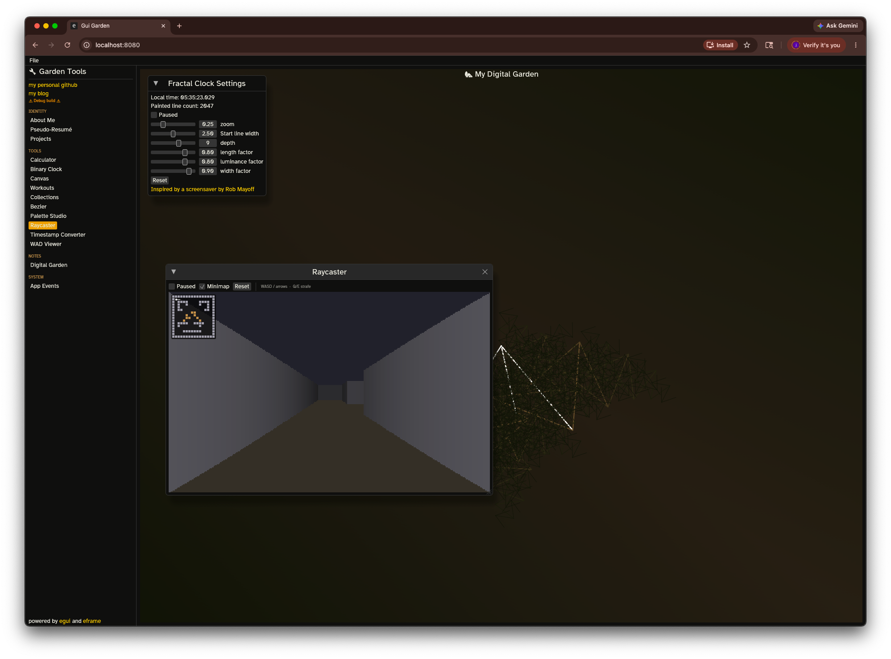
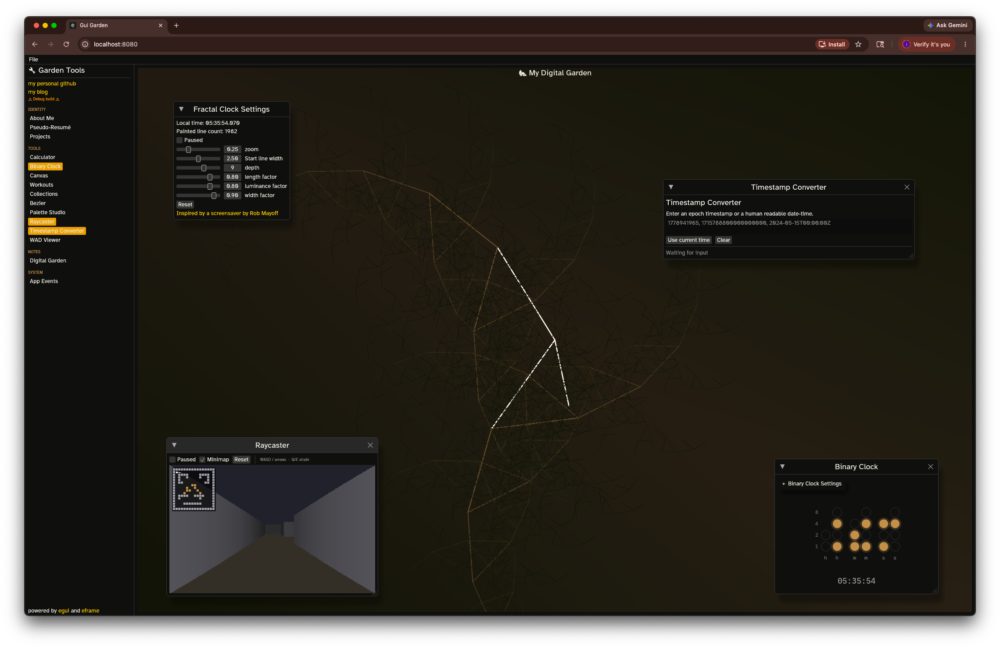

# Digital Garden

A multi-window "garden" of mini-apps built with [egui](https://github.com/emilk/egui) and [eframe](https://github.com/emilk/egui/tree/master/eframe) in Rust. It runs as a native desktop app and compiles to WebAssembly for the browser from the same codebase.

At its center is a markdown notes browser (the Digital Garden), surrounded by a collection of self-contained tools and toys: a calculator, clocks, a raycaster, a Doom WAD viewer, a palette studio, and more. Everything shares one amber, time-of-day-aware theme.





## Features

### Digital Garden notes browser

- Point it at any folder of `.md` files with YAML frontmatter (Obsidian vaults, an Astro blog's `content/posts`, plain notes).
- Wiki-style `[[links]]`, full-text search, a sidebar index, and a graph view of note connections.
- Browse history (back/forward) and a force-directed graph of how notes link together.
- Filesystem hot-reload: edits on disk show up live (native only, via `notify`).
- Recognizes both `created` and Astro's `pubDate` frontmatter for dates.

### Mini-apps

| App | What it does |
| --- | --- |
| Calculator | A basic calculator with a monospace readout. |
| Fractal Clock | An animated fractal that traces the current time; also drawn as the app backdrop. |
| Binary Clock | The current time rendered in binary. |
| Canvas | A JSON Canvas viewer with rich-text nodes that can deep-link into the garden. |
| Projects | A browsable list of projects. |
| Workouts | A workouts log loaded from a `workouts.json` file. |
| Collections | A collections browser. |
| Bezier Playground | An interactive bezier curve editor. |
| Palette Studio | A color-scheme explorer driving the app's accent palette. |
| Raycaster | A Wolfenstein-3D-style first-person raycaster (pure Rust, no WAD). WASD/arrows to move and turn, Q/E to strafe. |
| Timestamp Converter | Converts between epoch timestamps and human-readable dates. |
| WAD Viewer | A pure-Rust Doom WAD parser with a top-down 2D map renderer (things, linedefs, sectors, vertices). |
| About / Pseudo-Resume | Identity pages rendered with the vendored EasyMark markdown renderer. |
| App Events | A live feed of recent egui output events. |

All windows are togglable from the sidebar, the command palette, and keyboard shortcuts. Open windows are highlighted in the sidebar. Window state, the loaded notes directory, last-used file paths, and the active color scheme persist across restarts.

## Keyboard shortcuts

| Shortcut | Action |
| --- | --- |
| `Cmd/Ctrl + K` | Toggle the command palette (jump to any window, note, color scheme, or system action) |
| `Cmd/Ctrl + 1` | Toggle Digital Garden |
| `Cmd/Ctrl + 2` | Toggle Calculator |
| `Cmd/Ctrl + 3` | Toggle Canvas |
| `Cmd/Ctrl + 4` | Toggle Workouts |
| `Cmd/Ctrl + 5` | Toggle Projects |

## Getting started

Requires a recent Rust toolchain (the project pins `rust-version = "1.92"`).

### Native

```bash
cargo run
```

### Fast feedback while developing

```bash
cargo check
cargo clippy --all-targets --all-features -- -D warnings
cargo fmt --all
cargo test --workspace --all-targets --all-features
```

### Web (WebAssembly)

The web build targets `wasm32-unknown-unknown` and is served with [Trunk](https://trunkrs.dev/):

```bash
rustup target add wasm32-unknown-unknown
cargo install trunk
trunk serve   # live-reloading dev server
trunk build   # produces dist/
```

### Full CI-equivalent check

`check.sh` runs the same set of checks CI does: native and wasm `cargo check`, `cargo fmt --check`, clippy with warnings denied, the test suite, doc tests, and `trunk build`.

```bash
./check.sh
```

## Architecture

The crate is named `digital_garden`; `lib.rs` exposes a single eframe `App` called `TemplateApp` (in `src/app.rs`), which owns every mini-app and the notes browser.

- `src/apps/` holds the independent mini-apps. Each is owned by `TemplateApp` and toggled by an `*_is_open` bool. `easy_mark` is a vendored markdown-ish renderer.
- `src/digital_garden/` holds the notes app: filesystem loading (`note_directory`), per-note state (`note`), the markdown parser (also reused by the canvas viewer), search, sidebar, graph view, history, and the filesystem watcher.
- Two project-wide traits live in `lib.rs`: `View` (renders into a `Ui`) and `AppWindow` (manages its own window with open/close state).

State persistence uses `serde` plus eframe's `persistence` feature. Fields marked `#[serde(skip)]` are runtime-only; user preferences and persisted file paths survive restarts.

Platform-conditional dependencies are split in `Cargo.toml`: native uses `rfd` (file dialogs), `notify` (filesystem watcher), and `tracing-subscriber`; wasm uses `web-sys`, `wasm-bindgen`, and `getrandom` with the `js` backend. Hot-reload and file dialogs are native-only and guarded with `cfg(not(target_arch = "wasm32"))`.

## Project layout

```
src/
  lib.rs                  View / AppWindow traits, module wiring
  app.rs                  TemplateApp: the single eframe App
  main.rs                 native + wasm entry points
  apps/                   independent mini-apps
  digital_garden/         the markdown notes browser
  wad.rs                  Doom WAD binary parser
  command_palette.rs      Cmd+K palette
  palette.rs              time-of-day accent color schemes
assets/                   fonts, icons, screenshots, web manifest
index.html, Trunk.toml    web entry + Trunk config
check.sh                  CI-equivalent check script
```

## Fonts and licensing

The UI bundles three SIL OFL fonts: Atkinson Hyperlegible (UI chrome), Lora (markdown body and headings), and IBM Plex Mono (code, the calculator readout, the binary clock).

Built with [egui](https://github.com/emilk/egui) and [eframe](https://github.com/emilk/egui/tree/master/eframe).
